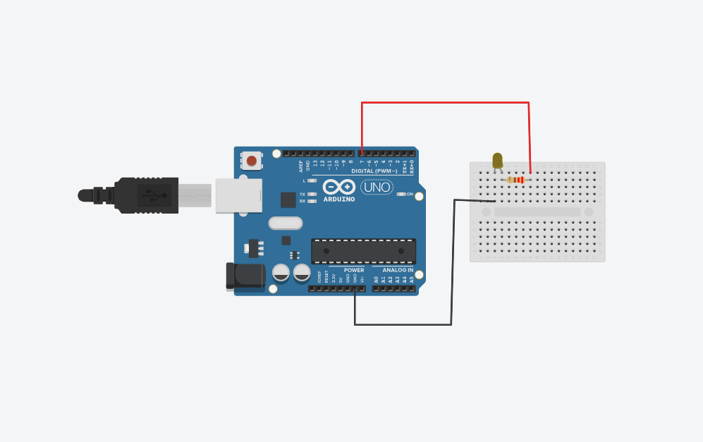
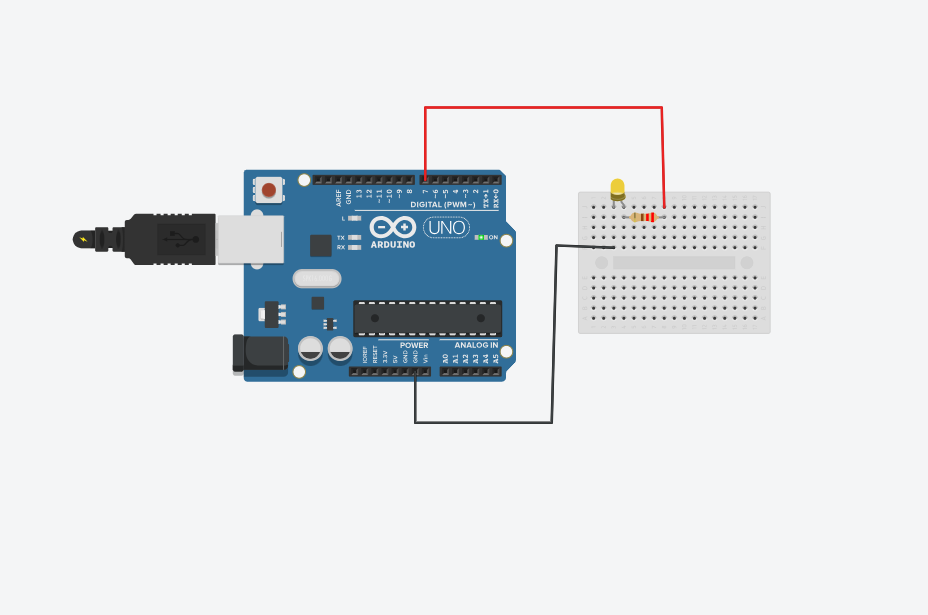

# Activity 01 – LED Blink

1. Activity Title

Activity 01 – LED Blink

2. Objective

To understand digital output programming using Arduino UNO by controlling an LED and making it blink at regular time intervals.

3. Components Used

- Arduino UNO
- LED
- Resistor
- Breadboard
- Jumper Wires

4. Circuit Diagram

The LED is connected to digital pin 7 of the Arduino UNO through a resistor. The other terminal of the LED is connected to GND.

5. Arduino Program

The Arduino program is stored in the `code.ino` file.

The program configures digital pin 7 as an output. The LED is turned ON for 1 second and then turned OFF for 1 second continuously.

6. Output

The LED successfully blinks in the Tinkercad simulation.

The LED remains ON for 1 second and OFF for 1 second, and this process repeats continuously.

7. Learning Outcome

- Understood the basic operation of Arduino digital output pins.
- Learned how to use `pinMode()` to configure a digital pin.
- Learned how to use `digitalWrite()` to control the LED.
- Understood the purpose of `delay()` for creating time intervals.
- Learned how to interface an LED with Arduino UNO.

8. Challenges Faced

- Verified that the LED was connected to the correct digital pin.
- Checked that digital pin 7 in the circuit matched the pin number in the program.
- Verified the LED and resistor connections.
- Tested the circuit in Tinkercad to ensure that the LED blinked correctly.

9. Real-World Applications

- Status indicators
- Warning systems
- Traffic signal controllers
- Electronic device indicators

10. Connection to this PoC

The LED blinking concept can be used as a visual status indicator in the Proof of Concept to show the operating status of the system.
