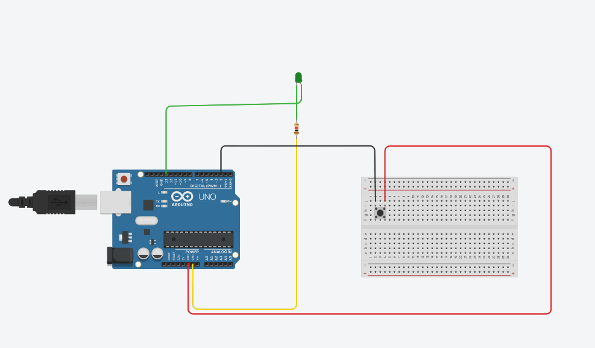

# Activity 02 – Push Button

## 1. Activity Title

Activity 02 – Push Button

## 2. Objective

To understand digital input programming using Arduino by controlling an LED with a push button.

## 3. Components Used

- Arduino UNO
- Push Button
- LED
- 220 Ω Resistor
- Breadboard
- Jumper Wires

## 4. Circuit Diagram

The circuit was designed and simulated using Tinkercad.

## 5. Arduino Program

The Arduino sketch is stored in the file `code.ino`.

## 6. Result

When the push button is pressed, the LED turns ON. When the push button is released, the LED turns OFF.
