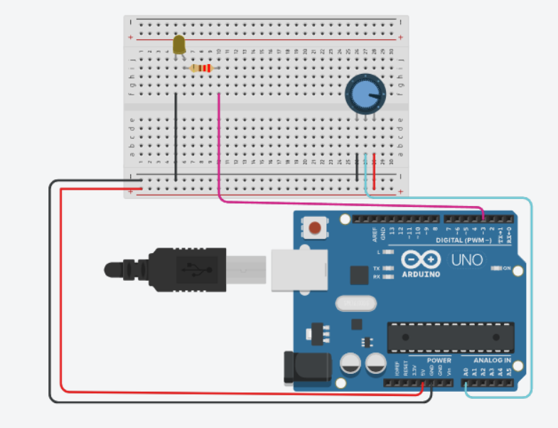
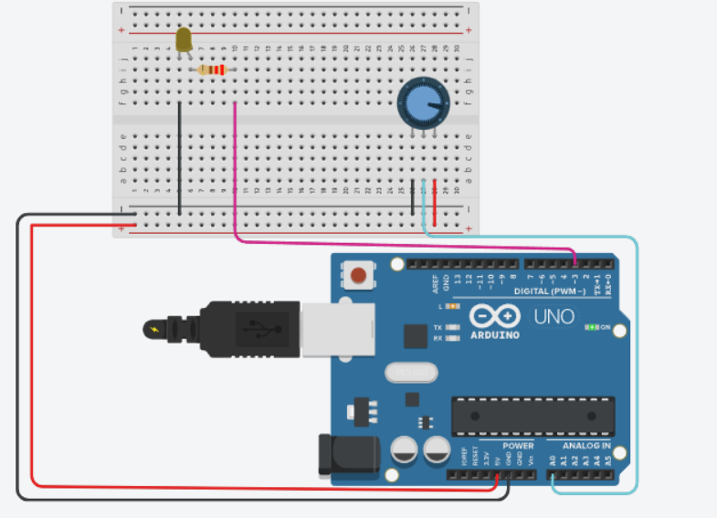

# Activity 03 – Potentiometer

## Objective

To understand the working of a potentiometer and control the brightness of an LED using an Arduino UNO.

## Components Used

- Arduino UNO
- Potentiometer
- LED
- 220 Ω Resistor
- Breadboard
- Jumper Wires

## Circuit Diagram

## Arduino Program

The Arduino program for this activity is stored in the `code.ino` file.

## Output

When the potentiometer knob is rotated, the LED brightness changes according to the potentiometer position.

## Learning Outcome

- Understood the working principle of a potentiometer.
- Learned how to read analog input using `analogRead()`.
- Learned how to use the analog pin A0.
- Learned how to convert sensor values using the `map()` function.
- Learned how to control LED brightness using PWM.

## Challenges Faced

- Incorrect potentiometer connections can produce incorrect readings. This was resolved by checking the 5V, GND, and A0 connections.
- Incorrect Arduino pin selection can prevent the LED from changing brightness. This was resolved by using a PWM pin.
- Incorrect circuit connections can prevent the LED from glowing. This was resolved by checking the LED polarity and resistor connection.

## Real-World Applications

- Light intensity control systems
- Volume control systems
- Motor speed control
- Temperature control systems

## Connection to Your PoC

The potentiometer concept can be used in a Proof of Concept where a user needs to manually adjust or control a system. For example, it can be used to set a threshold value or control the intensity of an output device.
