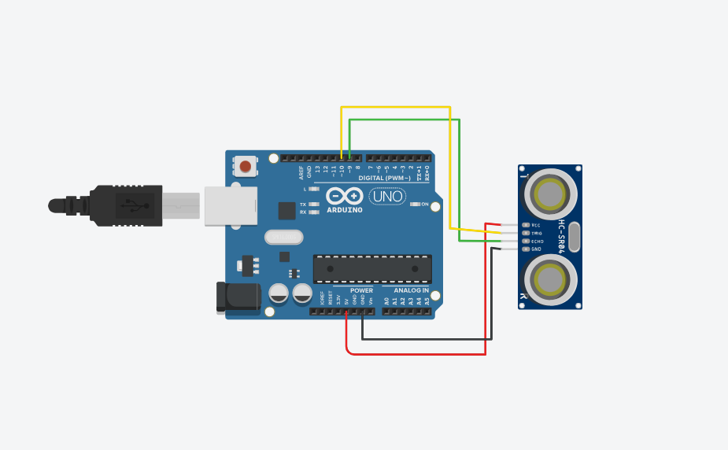
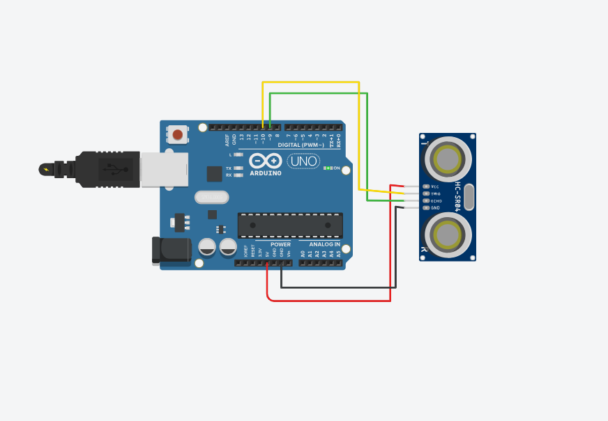

# Activity 04 – Ultrasonic Sensor

## Objective

To measure the distance between an object and an ultrasonic sensor using an Arduino UNO and an HC-SR04 ultrasonic sensor.

## Components Used

- Arduino UNO
- HC-SR04 Ultrasonic Sensor
- Breadboard
- Jumper Wires

## Circuit Diagram

## Arduino Program

The Arduino program for this activity is stored in the `code.ino` file.

## Output

The ultrasonic sensor measures the distance between the sensor and an object. The measured distance is displayed in the Serial Monitor.

## Learning Outcome

- Understood the working principle of an ultrasonic sensor.
- Learned how to use the TRIG and ECHO pins.
- Learned how to read sensor signals using Arduino.
- Learned how to calculate distance using the time taken by an ultrasonic pulse.
- Learned how to display sensor readings in the Serial Monitor.

## Challenges Faced

- Incorrect connections between the Arduino and ultrasonic sensor can prevent proper distance measurement. This was resolved by checking the VCC, GND, TRIG, and ECHO connections.
- Incorrect pin numbers in the program can produce incorrect readings. This was resolved by ensuring that the pin numbers in the code match the circuit connections.
- The sensor may not detect an object properly if the object is placed too far away or at an unsuitable angle. This was resolved by placing the object correctly in front of the sensor.

## Real-World Applications

- Obstacle detection systems
- Automatic parking systems
- Robot navigation
- Water level monitoring systems
- Smart security systems

## Connection to Your PoC

The ultrasonic sensor can be used in a Proof of Concept to measure distance or monitor levels. For example, it can be used in a smart water monitoring system to measure the water level in a tank and provide an alert when the water reaches a specific level.
