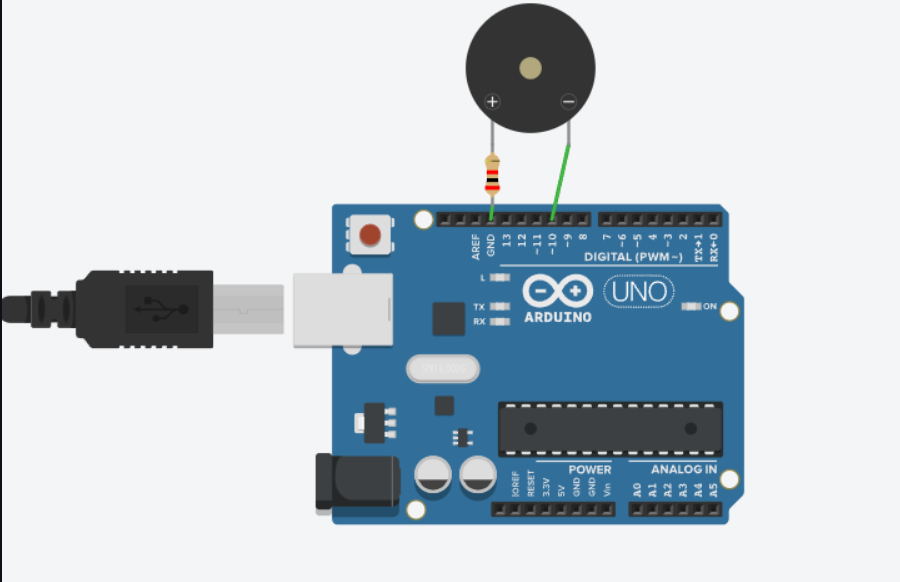
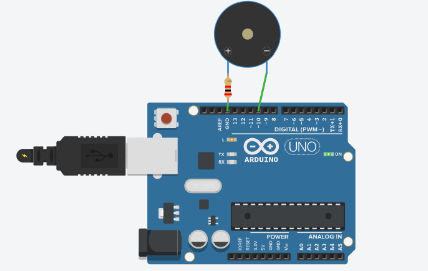

# Activity 05 – Buzzer

## Objective

To understand how to control a buzzer using an Arduino UNO.

## Components Used

- Arduino UNO
- Piezo Buzzer
- Resistor
- Jumper Wires

## Circuit Diagram

## Arduino Program

The Arduino program for this activity is stored in the `code.ino` file.

## Output

The buzzer turns ON for one second and turns OFF for one second continuously.

## Learning Outcome

- Understood the working principle of a buzzer.
- Learned how to use Arduino digital output pins.
- Learned the use of the `pinMode()` function.
- Learned the use of the `digitalWrite()` function.
- Learned how to control timing using the `delay()` function.

## Challenges Faced

- Incorrect connections can prevent the buzzer from producing sound. This was resolved by checking the positive and negative terminals.
- Incorrect pin numbers in the Arduino program can prevent the buzzer from working. This was resolved by matching the pin number in the code with the circuit.
- Incorrect resistor connections can affect the circuit operation. This was resolved by checking the circuit connections carefully.

## Real-World Applications

- Alarm systems
- Warning systems
- Fire alarm systems
- Security systems
- Electronic notification systems

## Connection to Your PoC

The buzzer can be used as an alert or warning device in a Proof of Concept. For example, it can provide an alarm when a sensor detects an unusual condition or when a measured value exceeds a specified limit.
