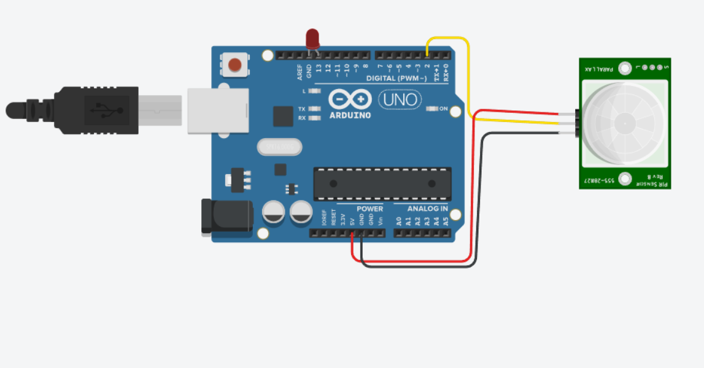
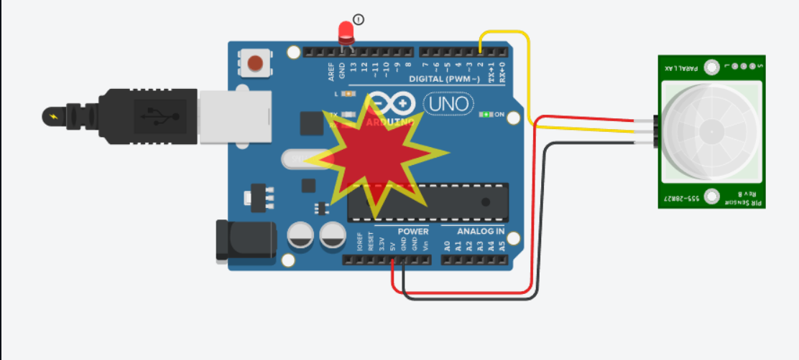

# Activity 06 – PIR Sensor

## Objective

To detect motion using a PIR sensor and control an LED using an Arduino UNO.

## Components Used

- Arduino UNO
- PIR Motion Sensor
- LED
- Jumper Wires

## Circuit Diagram

## Arduino Program

The Arduino program for this activity is stored in the `code.ino` file.

## Output

When the PIR sensor detects motion, the LED turns ON and a motion detection message is displayed in the Serial Monitor.

When no motion is detected, the LED remains OFF.

## Learning Outcome

- Understood the working principle of a PIR sensor.
- Learned how to detect motion using Arduino.
- Learned how to read a digital sensor input.
- Learned how to control an LED based on sensor data.
- Learned how to display sensor status using the Serial Monitor.

## Challenges Faced

- Incorrect connections between the PIR sensor and Arduino can prevent motion detection. This was resolved by checking the VCC, GND, and signal connections.
- Incorrect pin numbers in the program can cause the circuit to malfunction. This was resolved by matching the Arduino pins with the circuit connections.
- The PIR sensor may require a short initialization time before detecting motion properly.

## Real-World Applications

- Automatic security systems
- Motion-activated lights
- Smart home automation
- Intruder detection systems
- Automatic door systems

## Connection to Your PoC

The PIR sensor can be used in a Proof of Concept to detect human movement and automatically trigger an action. For example, it can activate an alarm, switch on a light, or send an alert when motion is detected.
