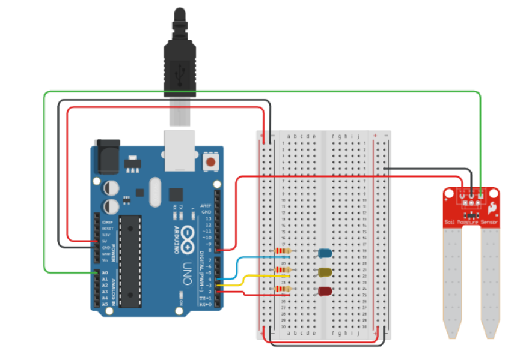
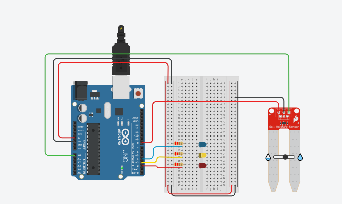

# Activity 07 – Soil Moisture Sensor

## Objective

To measure the moisture level in soil using a soil moisture sensor and Arduino UNO.

## Components Used

- Arduino UNO
- Soil Moisture Sensor
- Breadboard
- Jumper Wires

## Circuit Diagram

## Arduino Program

The Arduino program for this activity is stored in the `code.ino` file.

## Output

The soil moisture sensor measures the moisture level of the soil. The sensor value and soil condition are displayed in the Serial Monitor.

The output can indicate whether the soil is wet, moderately moist, or dry.

## Learning Outcome

- Understood the working principle of a soil moisture sensor.
- Learned how to read analog sensor values using Arduino.
- Learned how to use the analog input pin A0.
- Learned how to analyze sensor readings.
- Learned how sensors can be used for automated monitoring.

## Challenges Faced

- Incorrect sensor connections can result in incorrect readings. This was resolved by checking the VCC, GND, and analog output connections.
- The sensor values may vary depending on the moisture level. This was resolved by setting suitable threshold values.
- Incorrect analog pin selection can prevent the sensor from working properly. This was resolved by matching the circuit connection with the Arduino program.

## Real-World Applications

- Smart irrigation systems
- Automated agriculture
- Plant monitoring systems
- Greenhouse automation
- Water conservation systems

## Connection to Your PoC

The soil moisture sensor can be used in a smart irrigation system to continuously monitor the moisture level of soil. When the soil becomes dry, the system can automatically activate a water pump or send an alert to the user.
