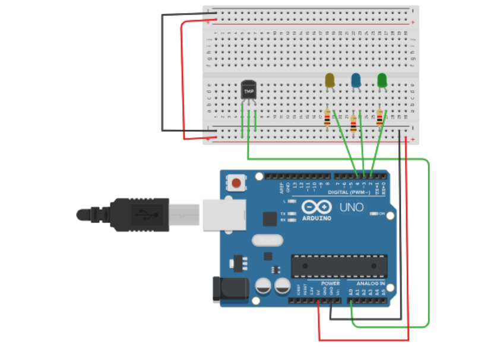
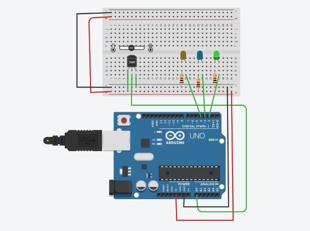

# Activity 08 – Temperature Sensor

## Objective

To measure the surrounding temperature using a temperature sensor and Arduino UNO.

## Components Used

- Arduino UNO
- TMP36 Temperature Sensor
- Breadboard
- Jumper Wires

## Circuit Diagram

## Arduino Program

The Arduino program for this activity is stored in the `code.ino` file.

## Output

The temperature sensor detects the surrounding temperature and sends the sensor reading to the Arduino.

The temperature value in degrees Celsius is displayed in the Serial Monitor.

## Learning Outcome

- Understood the working principle of a temperature sensor.
- Learned how to read analog sensor values using Arduino.
- Learned how to convert an analog sensor value into voltage.
- Learned how to calculate temperature in degrees Celsius.
- Learned how to display sensor readings in the Serial Monitor.

## Challenges Faced

- Incorrect sensor connections can produce inaccurate temperature readings. This was resolved by checking the VCC, GND, and output connections.
- Incorrect voltage calculations can produce incorrect temperature values. This was resolved by using the correct sensor conversion formula.
- Incorrect analog pin connections can prevent the sensor from working properly. This was resolved by ensuring that the sensor output was connected to A0.

## Real-World Applications

- Weather monitoring systems
- Smart home temperature control
- Industrial temperature monitoring
- Fire detection systems
- Agricultural monitoring systems

## Connection to Your PoC

The temperature sensor can be used in a smart monitoring system to continuously measure environmental temperature. The collected temperature data can be used to provide alerts or automatically control devices when the temperature exceeds a specified limit.
