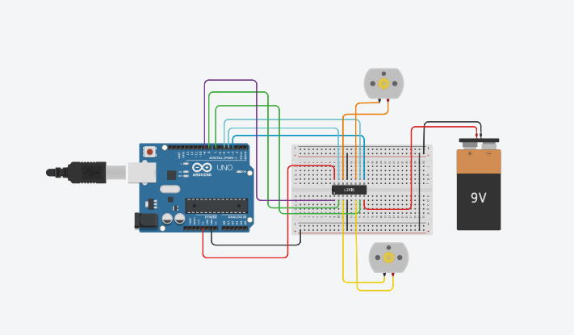
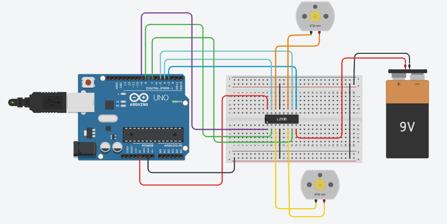

# Activity 09 – DC Motor Control

## Objective

To understand how to control the direction and speed of DC motors using an Arduino UNO and an L293D motor driver.

## Components Used

- Arduino UNO
- L293D Motor Driver IC
- 2 DC Motors
- 9V Battery
- Breadboard
- Jumper Wires

## Circuit Diagram

## Arduino Program

The Arduino program for this activity is stored in the `code.ino` file.

## Output

The two DC motors rotate in the forward direction, stop, and then rotate in the reverse direction according to the Arduino program.

## Learning Outcome

- Understood the working principle of a DC motor.
- Learned how to control DC motors using an L293D motor driver.
- Learned how to control the direction of motor rotation.
- Learned how PWM can be used to control motor speed.
- Understood the importance of using a motor driver between the Arduino and DC motors.

## Challenges Faced

- Directly connecting a DC motor to an Arduino can damage the Arduino. This was avoided by using an L293D motor driver.
- Incorrect motor driver connections can prevent the motors from rotating. This was resolved by checking the input, output, enable, VCC, and GND connections.
- Incorrect motor polarity can change the direction of rotation. This was resolved by checking the motor connections.
- The Arduino and motor supply must have a common ground for proper operation.

## Real-World Applications

- Robot vehicles
- Conveyor belt systems
- Automatic door systems
- Small robotic arms
- Electric vehicle prototypes

## Connection to Your PoC

DC motor control can be used in a Proof of Concept that requires mechanical movement. For example, motors can be used to drive wheels in an autonomous robot or operate a pump, conveyor, or other moving mechanism.
