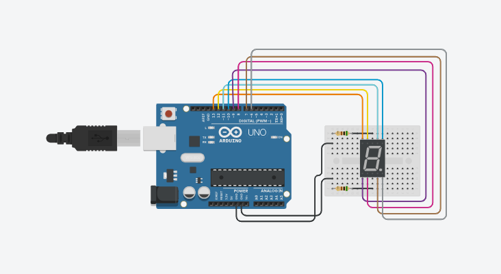
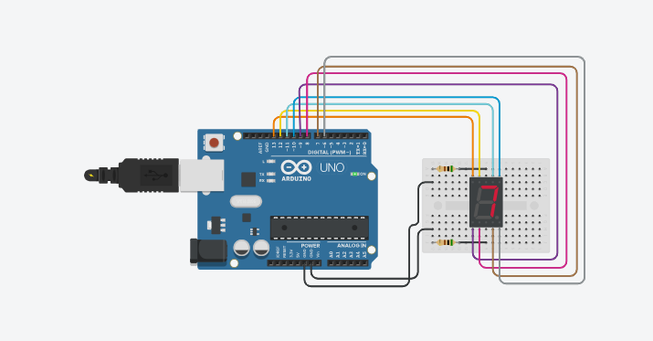

# Activity 10 – Seven Segment Display

## Objective

To understand the working of a seven-segment display and display numbers from 0 to 9 using an Arduino UNO.

## Components Used

- Arduino UNO
- Seven Segment Display
- 220 Ω Resistors
- Breadboard
- Jumper Wires

## Circuit Diagram

## Arduino Program

The Arduino program for this activity is stored in the `code.ino` file.

## Output

The seven-segment display successfully displays the numbers from 0 to 9 sequentially. Each number is displayed for one second before changing to the next number.

## Learning Outcome

- Understood the working principle of a seven-segment display.
- Learned how individual segments are controlled using Arduino digital pins.
- Learned how to display numbers from 0 to 9.
- Learned how to use arrays to store segment patterns.
- Improved understanding of digital output control.

## Challenges Faced

- Incorrect segment connections can result in an incorrect number being displayed. This was resolved by checking the connections of each segment.
- Incorrect pin numbers in the program can cause improper display output. This was resolved by matching the Arduino pin numbers with the circuit.
- Incorrect resistor connections can affect the LED segments. This was resolved by checking the resistor connections.

## Real-World Applications

- Digital clocks
- Counters
- Electronic meters
- Scoreboards
- Number display systems

## Connection to Your PoC

The seven-segment display can be used in a Proof of Concept to display numerical information such as sensor values, counts, levels, or system status. For example, it can display a measured value or countdown in an automated monitoring system.
