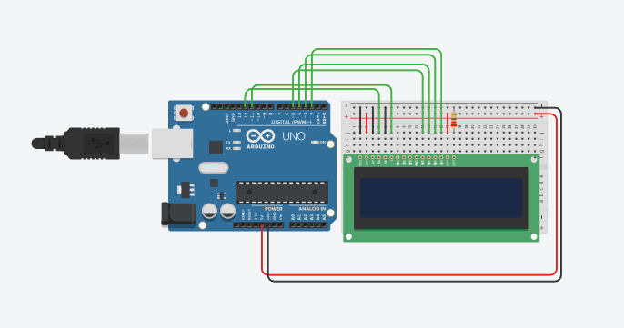
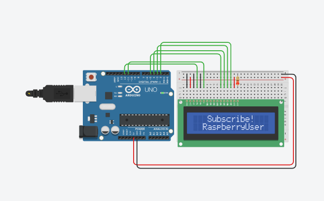

# Activity 11 – LCD Display

## Objective

To understand the working of a 16×2 LCD display and display text using an Arduino UNO.

## Components Used

- Arduino UNO
- 16×2 LCD Display
- 220 Ω Resistor
- Breadboard
- Jumper Wires

## Circuit Diagram

## Arduino Program

The Arduino program for this activity is stored in the `code.ino` file.

The program displays the messages "Subscribe!" and "RaspberryUser" on the 16×2 LCD.

## Output

The 16×2 LCD successfully displays the following messages:

Subscribe!

RaspberryUser

## Learning Outcome

- Understood the working principle of a 16×2 LCD display.
- Learned how to interface an LCD with Arduino UNO.
- Learned how to use the LiquidCrystal library.
- Learned how to display text using the `lcd.print()` function.
- Learned how to position text using the `lcd.setCursor()` function.

## Challenges Faced

- Incorrect LCD pin connections can prevent the display from working. This was resolved by checking the RS, E, data, power, and ground connections.
- Incorrect pin numbers in the program can result in incorrect display output. This was resolved by matching the Arduino pins with the circuit.
- The LCD may not display text properly if its power and contrast connections are incorrect. This was resolved by checking the LCD power and contrast connections.

## Real-World Applications

- Digital information displays
- Temperature monitoring systems
- Industrial control panels
- Electronic measuring instruments
- User interface systems

## Connection to Your PoC

The LCD display can be used in a Proof of Concept to provide real-time information to the user. For example, it can display sensor readings, system status, alerts, temperature, moisture level, or other important measurements.
